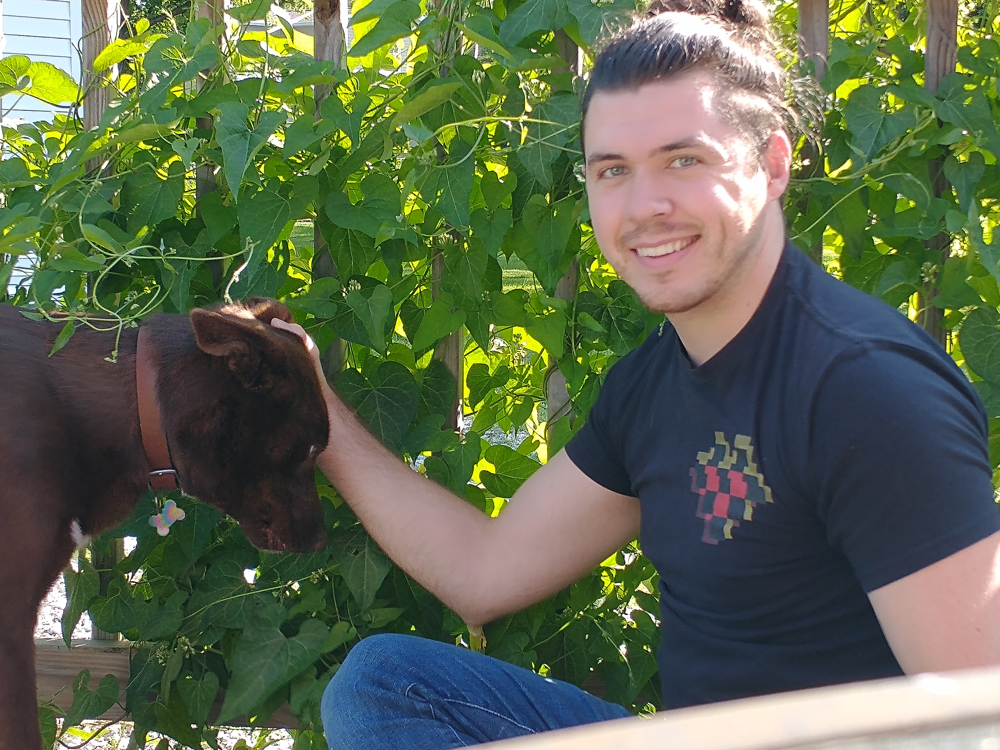
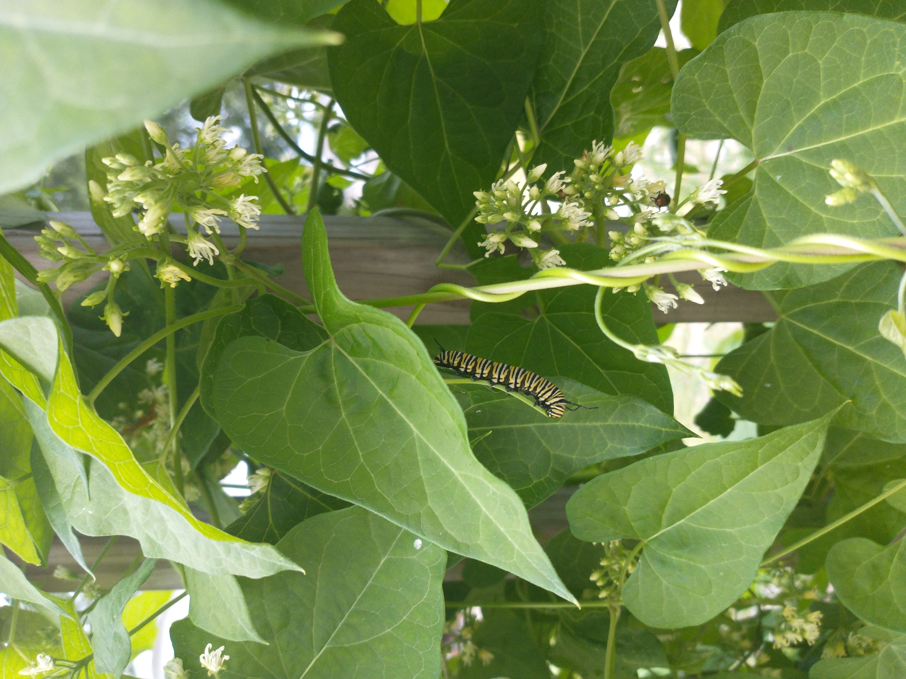
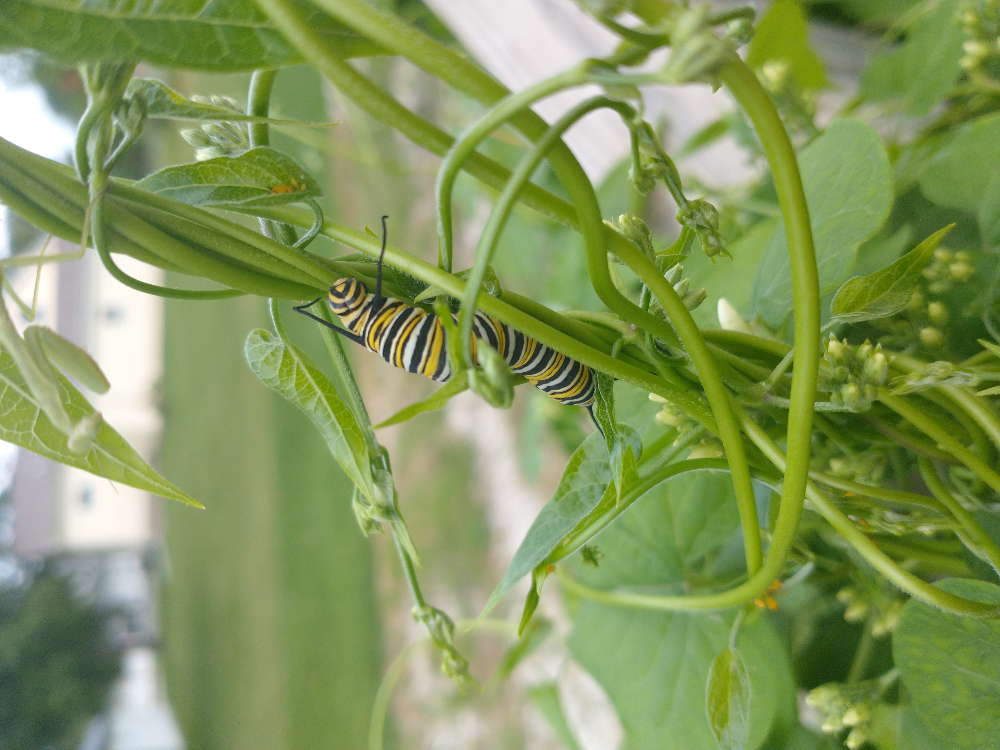

# My Monarch Project

It all started one sunny afternoon in July. I was walking outside, admiring the menagerie of weird bugs on a vine which had eaten up a fence in my backyard.

<figure style="width:auto;height:90vh;">
<figcaption>Here is a picture of Khaleesi and me in front of said vine.</figcaption>

</figure>

One bug caught my attention: a monarch caterpillar. I recognized it immediately because when I was little, my mom used to catch them, feed them milkweed, and watch them metamorphose into butterflies.

<figure style="width:auto;height:90vh;">
<figcaption>An unexpected sight!</figcaption>

</figure>

I was extremely surprised to see it on my vine. You see, monarch caterpillars only eat *milkweed*. I knew this because I had witnessed my mother stop her van on a country road, get out, grab some milkweed from a ditch, and bring it home. This had been necessary, she explained, because no other leaf would do.

<figure style="width:auto;height:90vh;">
<figcaption>This is the milkweed that my mom fed to the caterpillars she raised. Photo by Homer Edward Price.</figcaption>

</figure>

<figure style="width:auto;height:90vh;">
<figcaption>Check out this 360 GIF of a monarch chrysalis that's about to hatch!</figcaption>

</figure>